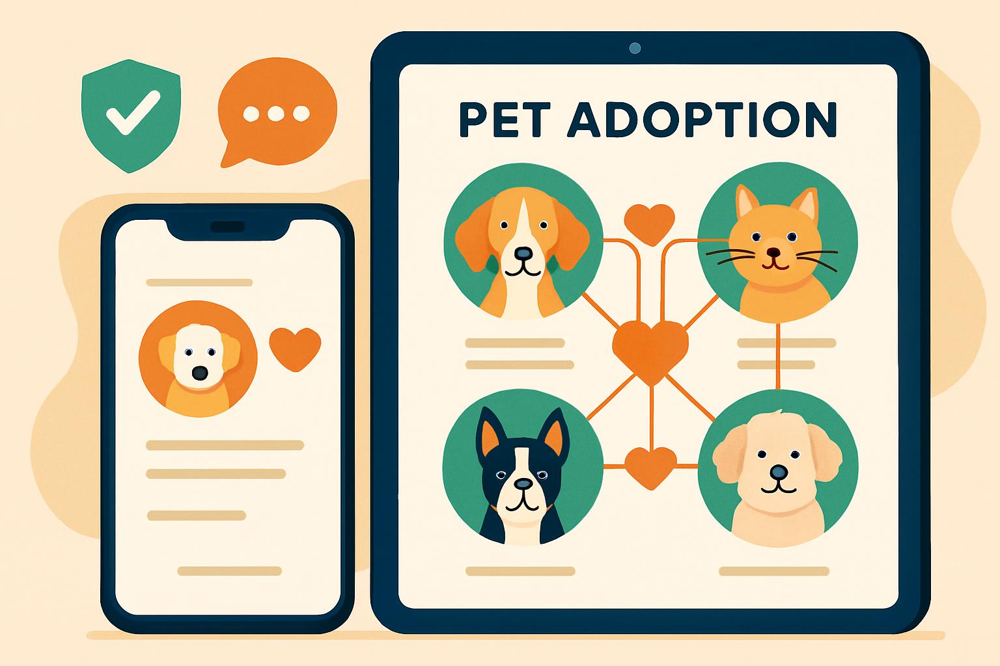

# 🐾 PetMatch - Plataforma Integrada para Adoção Responsável



"Conectar pessoas e ONGs de forma segura, intuitiva e inteligente, garantindo adoções responsáveis e acompanhamento contínuo dos pets."

## 📖 Sobre o Projeto

Este repositório hospeda a **Landing Page** do **PetMatch**, um projeto conceitual de uma plataforma digital inovadora para unificar ONGs, lares temporários e adotantes.

O objetivo desta página web é apresentar a proposta de valor, a identidade visual e as funcionalidades planejadas para o sistema, servindo como ponto de contato inicial para validação da ideia.

Este projeto foi desenvolvido como parte da disciplina de **Prática de Programação Web** na **Faculdade Municipal de Palhoça (FMP)**.

---

## 👥 Equipe de Desenvolvimento

| Aluno | Papel |
| :--- | :--- |
| **Aldair Alcin** | Designer UX/UI & Frontend |
| **Leonardo Santana** | Desenvolvedor Frontend |
| **Messias Tadeu** | Analista de Negócios & Estratégia |

---

## 🎯 O Problema

Durante a fase de pesquisa e ideação baseada no Lean Canvas, identificamos lacunas críticas no cenário atual de adoção de animais:

**Interface Desatualizada:** Muitos sistemas parecem antigos, pouco intuitivos e com usabilidade comprometida.
**Busca Ineficiente:** Falta de filtros adequados, ausência de geolocalização inteligente e dificuldade para encontrar animais específicos.
**Falta de Engajamento:** Inexistência de acompanhamento pós-adoção, como lembretes de vacinas ou comunidades de apoio.
**Insegurança:** Riscos de golpes e falta de validação rigorosa de usuários.
**Gestão de Dados:** ONGs carecem de dashboards para gerenciar adoções e visualizar estatísticas.

---

## 🚀 Nossa Solução (Escopo do Sistema)

O PetMatch propõe uma abordagem moderna baseada em tecnologia e impacto social. Abaixo estão as **funcionalidades planejadas** para a plataforma completa, apresentadas conceitualmente nesta Landing Page:

💕 **Sistema de Match Inteligente:** Algoritmo exclusivo que sugere animais com base no perfil e estilo de vida do usuário.

📍 **Geolocalização:** Mapa interativo para encontrar animais próximos e rotas até as ONGs.

🛡️ **Verificação de Usuários:** Validação de documentos e assinatura digital de termos de responsabilidade.

🎮 **Gamificação Pós-Adoção:** Sistema de pontos e conquistas para incentivar cuidados contínuos e engajamento na comunidade.

🧠 **IA para Cadastro:** Preenchimento automático de dados do animal (raça, porte) via reconhecimento de imagem.

---

## 🛠️ Metodologia e Ferramentas

O desenvolvimento seguiu um fluxo estruturado de engenharia de software e design, utilizando ferramentas de apoio para organização e entrega:

### 1. Planejamento e Ideação

**Lean Canvas:** Mapeamento do modelo de negócio, proposta de valor e segmentos de clientes.

**Documentação:** Estruturação de requisitos e definição da arquitetura conceitual.

### 2. Design e Prototipagem
**Figma/Miro:** Criação de Wireframes e definição da hierarquia visual da Landing Page.

### 3. Desenvolvimento (Landing Page)
* **HTML5:** Estrutura semântica moderna.
* **CSS3:** Estilização avançada com Flexbox, Grid, Variáveis CSS e Animações.
* **Bootstrap 5:** Framework para responsividade e componentes ágeis.
* **JavaScript:** Manipulação do DOM para interatividade (Menu responsivo).

### 4. Colaboração
* **Git & GitHub:** Controle de versão e colaboração em equipe.

---

## 📂 Estrutura do Projeto

```text
pet-match-landing-page/
│
├── css/
│   └── style.css      # Estilização personalizada e variáveis
├── img/
│   ├── hero-adoption.jpg
│   ├── solution-platform.jpg
│   └── ...            # Assets visuais
├── js/
│   └── script.js      # Lógica de interatividade
└── index.html         # Estrutura principal da Landing Page
```

## 🔗 Como Acessar

Você pode visualizar a versão atual do projeto hospedada no GitHub Pages:

👉 [Acesse o PetMatch aqui](https://lsantanadev.github.io/pet-match-landing-page/)